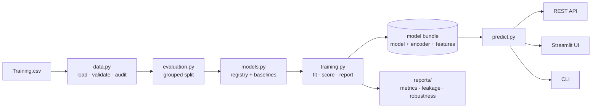

# Disease Predictor

Ranks likely diseases from reported symptoms — and measures honestly how much
that ranking is worth.

[](https://github.com/Ritwick14999/Disease-Predictor/actions/workflows/ci.yml)


> ⚠️ **Educational project. Not a medical device and not medical advice.**
> It must not be used for diagnosis, triage, or any health decision.

---

## The finding

This started as a notebook that trained XGBoost on a public symptom dataset and
reported this:

```
Train accuracy: 1.0
Test accuracy : 1.0
CV scores: [1. 1. 1. 1. 1.]   Mean CV: 1.0   Std CV: 0.0
```

Perfect accuracy, reproduced under 5-fold cross-validation. That is not a result
to celebrate — it is a prompt to ask what the evaluation is measuring.

**It was measuring memorisation.** The dataset contains many repeated rows. A
stratified random split shuffles *rows*, not symptom *patterns*, so
byte-identical rows land in both the training and the test set. Every such test
row is one the model has already seen. Two other structural facts finish the
explanation: the symptom→disease mapping is near-deterministic, so the ceiling
genuinely is 100%; and the table holds **exactly 120 rows per disease**, so the
SMOTE step in the original pipeline was a no-op that resampled nothing.

So this repository rebuilds the project around the question the 100% was hiding:
*how do you actually know whether a model has learned anything?*

| | Original | This version |
| --- | --- | --- |
| Split protocol | Stratified random | **Grouped** — identical symptom patterns never straddle the split |
| Duplicate rows | Unmeasured | `dp audit` quantifies them; deduplicated before training |
| Baselines | None | Majority, rule-based matcher, tree, linear, forest, XGBoost |
| Metrics | Accuracy | Balanced accuracy, macro-F1, top-3, log loss, calibration error |
| Noise | Untested | Robustness grid over symptom dropout and false positives |
| Imbalance | SMOTE (a no-op, and wrong for binary features) | Off by default, with reasons |
| Delivery | Notebook | Installable package, CLI, REST API, Streamlit UI, Docker |
| Verification | None | 185 tests, 96% coverage, CI on 3 Python versions |

The full argument is in **[docs/METHODOLOGY.md](docs/METHODOLOGY.md)**.

---

## Quickstart

No dataset needed — `--synthetic` generates a table with the same structure and
the same duplicate-row failure mode.

```bash
git clone https://github.com/Ritwick14999/Disease-Predictor.git
cd Disease-Predictor
python -m venv .venv && source .venv/bin/activate
pip install -e ".[all]"

dp audit --synthetic        # quantify duplicate rows and leakage risk
dp train --synthetic        # train, evaluate honestly, write reports
dp predict itching skin_rash chills   # rank diseases, with reasons
```

To use the real dataset, drop `Training.csv` into `data/raw/` (see
[data/README.md](data/README.md)) and omit `--synthetic`.

---

## What it does



The **bundle** is the load-bearing idea: model, label encoder and ordered
feature list are serialised together, so the classic train/serve column-order
mismatch is impossible rather than merely unlikely.

---

## Results

Every number is regenerated by `dp train`, written to `reports/metrics.json` and
`reports/training_report.md`, embedded in the model bundle, and served at
`GET /model-info`. Nothing is hard-coded in this README.

The output below is a real run on **synthetic** data, so the pipeline is
demonstrable without the dataset. Numbers on the real file will differ — and its
`leakage_gap` is much larger, because it repeats rows far more heavily than the
generator does.

### 1. Robustness — read this first

Accuracy when reported symptoms are dropped or spuriously added. This is the
input a real user produces, and it is where models that all look perfect on
clean data separate.

| dropout | false positives | accuracy | top-3 |
| --- | --- | --- | --- |
| 0.0 | 0.00 | 0.974 | 1.000 |
| 0.1 | 0.00 | 0.953 | 1.000 |
| 0.1 | 0.05 | 0.881 | 0.979 |
| 0.2 | 0.03 | 0.862 | 0.969 |

Top-3 degrades far more gracefully than top-1 — which is the argument for
presenting a shortlist rather than a verdict.

### 2. Baselines — does the model earn its complexity?

Every model, same leakage-aware protocol:

| model | accuracy | macro-F1 | fit seconds |
| --- | --- | --- | --- |
| logreg | 0.995 | 0.995 | 0.15 |
| **rules** *(no learning at all)* | **0.992** | **0.992** | **0.11** |
| random_forest | 0.990 | 0.989 | 4.08 |
| xgboost | 0.982 | 0.981 | 1.39 |
| tree | 0.769 | 0.777 | 0.12 |
| majority | 0.081 | 0.013 | 0.11 |

`rules` is `SymptomSignatureMatcher`: Jaccard overlap against each disease's
symptom signature. No gradients, no training loop. It matches gradient boosting
at a fraction of the cost — which is the honest conclusion about this task. It
is a lookup problem, and the ensemble is not earning its complexity.

Shipping the baseline that beats your headline model is the point of having one.

### 3. Leakage gap

The same model on the same raw rows, scored two ways:

| protocol | accuracy | macro-F1 |
| --- | --- | --- |
| random | 0.994 | 0.995 |
| grouped | 0.986 | 0.986 |
| **leakage_gap** | **+0.008** | **+0.009** |

That gap is score the random protocol hands over for free.

---

## Usage

### CLI

```bash
dp audit                     # duplicate rows, unique patterns, leakage risk
dp train --model xgboost     # train, evaluate, write bundle + reports
dp benchmark                 # compare every model under the honest protocol
dp predict itching skin_rash chills --follow-up
dp symptoms fever            # search the symptom vocabulary
dp info                      # provenance of the trained artifact
dp serve                     # REST API on :8000
```

`dp predict` explains itself:

```
1. Fungal infection - 87.4%
     because skin_rash (52% of the evidence)
     because itching (31% of the evidence)

Most informative symptoms to check next:
  - nodal_skin_eruptions (would shift the top probability by +8.1%)
```

### REST API

```bash
dp serve   # then open http://127.0.0.1:8000/docs
```

| Endpoint | Purpose |
| --- | --- |
| `GET /health` | Liveness; reports `degraded` rather than crashing when no model is loaded |
| `GET /model-info` | Training config, dataset fingerprint, scores, library versions |
| `GET /symptoms?q=` | Vocabulary, with fuzzy search for autocomplete |
| `GET /diseases` | Every predictable label |
| `POST /predict` | Ranked shortlist with attribution |

```bash
curl -X POST http://127.0.0.1:8000/predict \
  -H 'Content-Type: application/json' \
  -d '{"symptoms": ["itching", "skin_rash", "chills"], "top_k": 3, "follow_up": true}'
```

Unknown symptoms do not fail the request — they come back in `unknown_symptoms`
with spelling suggestions, so a typo can never silently change the answer.

### Streamlit UI

```bash
streamlit run app/streamlit_app.py
```

Symptom picker, ranked results, a per-symptom evidence breakdown for each
candidate, and the follow-up questions worth asking next. The sidebar shows
which artifact is answering and how it scored.

### Docker

```bash
docker build -t disease-predictor .
docker run --rm -p 8000:8000 disease-predictor
```

Multi-stage build, non-root user, health check, and a demo model baked in so the
image is useful immediately. Mount a bundle over `/app/artifacts` to serve a
model trained on the real dataset.

---

## Project structure

```
src/disease_predictor/
  config.py      Typed, serialisable run configuration
  data.py        Loading, schema validation, duplicate/leakage audit, synthetic generator
  features.py    SymptomEncoder — canonical names, fuzzy matching, fixed feature order
  models.py      Model registry + SymptomSignatureMatcher baseline
  evaluation.py  Metrics, grouped splits, calibration, robustness benchmark
  explain.py     Global importance + occlusion attribution + counterfactuals
  training.py    End-to-end run → bundle, metrics.json, markdown report
  predict.py     Inference contract: warnings, attribution, disclaimer
  api.py         FastAPI service
  cli.py         The `dp` command

app/             Streamlit UI
tests/           185 tests across 8 modules
docs/            Model card, data card, methodology
notebooks/       Original exploration, rewritten around the leakage analysis
```

---

## Engineering practices

- **185 tests, 96% coverage.** Not just happy paths: the suite asserts that a
  random split *does* leak identical patterns across the boundary and a grouped
  split *does not*, that a saved bundle reloads and predicts identically, that
  the API degrades to 503 with a next step when no model is present, and that
  unknown symptoms surface instead of vanishing.
- **CI on Python 3.10/3.11/3.12** — lint, tests, a full audit→train→serve→predict
  pipeline run, and a Docker build that must answer a real HTTP request.
- **Runs anywhere.** The synthetic generator is part of the package, so tests,
  CI and the demo never need the dataset.
- **Reproducible by construction.** One config object per run; explicit seeds;
  SHA-256 dataset fingerprint; library versions recorded in the artifact.
- **Typed and documented.** Type hints throughout; every public function
  documents what it raises.

```bash
make help        # all workflows
make test        # pytest
make cov         # coverage report
make lint        # ruff
make demo        # train on synthetic data
```

---

## Documentation

| Document | Contents |
| --- | --- |
| [METHODOLOGY.md](docs/METHODOLOGY.md) | The leakage argument, split protocols, why SMOTE is wrong here, metric choices |
| [MODEL_CARD.md](docs/MODEL_CARD.md) | Intended use, out-of-scope use, limitations, ethical considerations |
| [DATA_CARD.md](docs/DATA_CARD.md) | Dataset structure, provenance, and five known defects |
| [data/README.md](data/README.md) | How to obtain the dataset, or run without it |

---

## Limitations

Stated plainly, because a model that overstates itself is worse than no model:

- **The dataset is close to a lookup table.** High scores reflect a clean,
  near-deterministic mapping, not diagnostic skill.
- **Closed world.** 41 diseases, 132 symptoms. The model cannot say "I don't
  know" — for a condition outside its label set it returns a confident,
  confidently wrong ranking.
- **Binary symptoms only.** No severity, duration, onset, age, sex, comorbidity
  or test results — the things that dominate real diagnosis.
- **Fairness cannot be assessed.** The data carries no demographic attributes.
  Absence of evidence of bias is not evidence of its absence.
- **No external validation.** One constructed table, no second cohort, no
  temporal split.

---

## License

MIT — see [LICENSE](LICENSE).

**This project is for education. It is not a medical device, and its output is
not medical advice.**
